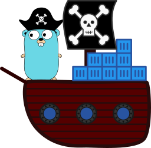

# go-pillage-registries




This project takes a Docker registry and pillages the manifest and configuration for each image in its catalog.

It uses Google's [crane](https://github.com/google/go-containerregistry/blob/master/cmd/crane/doc/crane.md) command's package, which should follow docker's keychain semantics.
If you would like to override this, just change `authn.DefaultKeychain` as described in the <https://github.com/google/go-containerregistry/tree/master/pkg/authn/k8schain>

## Install:

```bash
git clone https://github.com/nccgroup/go-pillage-registries.git

cd go-pillage-registries
go install .

```

## Usage:

```
$ pilreg
Usage:
  pilreg <registry> [flags]

Flags:
  -c, --cache string     Path to cache image layers (optional, only used if images are pulled)
  -h, --help             help for pilreg
  -i, --insecure         Fetch Data over plaintext
  -r, --repos strings    list of repositories to scan on the registry. If blank, pilreg will attempt to enumerate them using the catalog API
  -o, --results string   Path to directory for storing results. If blank, outputs configs and manifests as json object to Stdout.(must be used if 'store-images` is enabled)
  -k, --skip-tls         Disables TLS certificate verification
  -s, --store-images     Downloads filesystem for discovered images and stores an archive in the output directory (Disabled by default, requires --results to be set)
  -t, --tags strings     list of tags to scan on each repository. If blank, pilreg will attempt to enumerate them using the tags API
  -w, --workers int      Number of workers when pulling images. If set too high, this may cause errors. (optional, only used if images are pulled) (default 8)


```

## Example:

In the [example directory](example/) there is an example of an image which
Docker image that is a server that has a secret.

